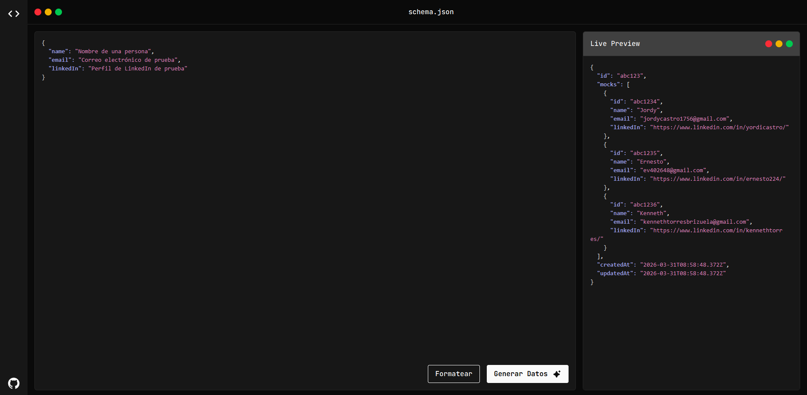

# Mockit

> Acelera el desarrollo frontend generando APIs REST mock completamente funcionales bajo demanda.

Genera APIs mock listas para producción a partir de plantillas JSON en segundos, permitiendo que equipos de frontend y backend trabajen en paralelo sin esperar a que el backend esté listo.

---

## 🚀 Demo

**[Ver Demo](http://mocktit-app-frontend-3nxh5g-612650-144-225-147-108.traefik.me/)** 

La aplicación está desplegada en **CubePath**, un proveedor de servidores VPS de alto rendimiento optimizado para aplicaciones Node.js.

---

## 📸 Capturas de Pantalla



**Características visuales:**
- Interfaz intuitiva para pegar plantillas JSON
- Generación instantánea de APIs con URL única
- Panel de configuración de métodos HTTP
- Documentación automática de endpoints

---

## Tabla de Contenidos

- [🚀 Demo](#-demo)
- [📸 Capturas de Pantalla](#-capturas-de-pantalla)
- [Descripción General](#descripción-general)
- [Características Principales](#características-principales)
- [Cómo Funciona](#cómo-funciona)
- [Stack de Tecnologías](#stack-de-tecnologías)
- [Inicio Rápido](#inicio-rápido)
- [Estructura del Proyecto](#estructura-del-proyecto)
- [Arquitectura](#arquitectura)
- [📡 Endpoints de la API](#-endpoints-de-la-api)
- [🌐 Cómo se Utilizó CubePath](#-cómo-se-utilizó-cubepath)
- [Contribuciones](#contribuciones)
- [Integrantes](#integrantes)

---

## Descripción General

**Mockit** es una plataforma web diseñada para eliminar la dependencia entre equipos de desarrollo frontend y backend. En lugar de esperar a que las APIs del backend estén listas, los desarrolladores frontend pueden pegar una plantilla JSON y recibir instantáneamente una API REST completamente funcional.

### Problema Resuelto

- **Frontend bloqueado**: Los equipos no pueden comenzar a construir hasta que las APIs del backend estén listas
- **Sobrecarga en backend**: Los arquitectos dedican tiempo a construir infraestructura mockup
- **Realismo de datos**: Los datos mock suelen ser poco realistas o genéricos

### Solución

Mockit interpreta plantillas JSON definidas por el usuario, genera de forma inteligente datos mock realistas, y sirve APIs REST dinámicas con soporte completo de CRUD y persistencia de datos.

---

## Características Principales

- **Generación Instantánea de APIs**: Pega JSON → Obtén una API funcional en segundos
- **Generación Inteligente de Datos**: Interpreta descripciones como "precio entre 0 y 999.99" o "categoría de videojuegos" y genera datos realistas
- **Operaciones CRUD Completas**: Endpoints GET, POST, PUT, PATCH, DELETE
- **Capacidades de Consulta**:
  - Filtrado mediante parámetros de consulta
  - Soporte de paginación
  - Ordenamiento por campo
- **Persistencia de Datos**: APIs almacenadas en base de datos, accesibles entre sesiones del navegador
- **Múltiples Dominios**: Funciona con cualquier tipo de entidad (productos, usuarios, pedidos, vehículos, etc.)
- **Instancias Independientes**: Cada API está completamente aislada
- **100% Gratuito**: Sin backend requerido, sin API keys, sin registro

---

## Cómo Funciona

### 1. Entrada del Usuario

El usuario define una plantilla JSON con:

- **Datos estructurados**: `{ "id": 1, "name": "Product A" }`
- **Patrones descriptivos**: `{ "price": "número entre 10 y 500" }`
- **Pistas contextuales**: `{ "category": "de videojuegos" }`

### 2. Análisis Inteligente

- Detecta rangos numéricos: `"entre X e Y"` → genera número aleatorio
- Reconoce tipos de datos: `"email"`, `"date"`, `"phone"` → genera valores apropiados
- Extrae contexto: `"de $category"` → genera valores específicos del dominio
- Fallback: Patrones desconocidos → genera datos genéricos realistas

### 3. Creación Dinámica de API

- Genera URL única: `https://mockit.dev/api/{id-único}`
- Crea rutas Express para operaciones CRUD
- Almacena configuración en base de datos
- Devuelve URL de la API al usuario

### 4. Simulación de Datos

- **GET** `/api/{id}` → Devuelve datos mock paginados/filtrados
- **POST** → Añade nueva entrada al conjunto de datos mock
- **PUT/PATCH** → Actualiza registro mock existente
- **DELETE** → Eliminan registro mock
- Los cambios persisten en la base de datos SQLite local

---

## Stack de Tecnologías

### Frontend

- **Astro 6** para sitios web estáticos y dinámicos de alto rendimiento
- **Tailwind CSS 4** para estilos
- **TypeScript** para seguridad de tipos
- **Vite** integrado (usado por Astro internamente)

### Backend

- **Node.js** con **Express 5.x**
- **Hexagonal Architecture** (Ports & Adapters)
- **TypeScript** en modo strict
- **Zod 4** para validación en tiempo de ejecución
- **Base de datos**: SQLite con Better-SQLite3
- **ORM**: Drizzle ORM para gestión de esquemas y consultas

### Gestor de Paquetes

- **pnpm** para monorepo + eficiencia de archivos de bloqueo

---

## Inicio Rápido

### Requisitos Previos

- Node.js ≥ 22.12.0
- pnpm ≥ 10.x
- Git

### Instalación

```bash
# Clona el repositorio
git clone https://github.com/usuario/mockit.git
cd mockit

# Instala dependencias
pnpm install

# Configura el ambiente (si es necesario)
cp mockit-api/example.env mockit-api/.env
```

### Desarrollo

```bash
# Backend: Inicia el servidor de desarrollo (hot-reload en puerto 3000)
cd mockit-api
pnpm dev

# Frontend: Inicia el servidor Astro (en puerto 4321)
cd mockit-app
pnpm dev

# Visita http://localhost:4321
```

### Build para Producción

```bash
# Backend
cd mockit-api
pnpm build
pnpm start

# Frontend
cd mockit-app
pnpm build
# Despliega la carpeta dist/ en un servidor estático
```

---

## Estructura del Proyecto

```
mockit/
├── mockit-api/                  # Backend (Node.js + Express)
│   ├── AGENTS.md                # Reglas de agentes IA para backend
│   ├── app.ts                   # Punto de entrada
│   ├── package.json
│   ├── tsconfig.json
│   └── src/
│       ├── domain/              # Lógica de negocio (agnóstico de framework)
│       │   ├── entities/        # Modelos de dominio (Usuario, API, MockData)
│       │   └── interfaces/      # Definiciones de puertos
│       ├── application/         # Orquestación
│       │   ├── use-cases/       # Operaciones de negocio
│       │   ├── dtos/            # Contratos de datos
│       │   └── mappers/         # Transformaciones de entidades
│       └── infrastructure/      # Específico de framework
│           ├── api/             # Configuración Express
│           ├── controllers/     # Manejadores HTTP
│           ├── repositories/    # Acceso a base de datos
│           └── routes/          # Rutas de la API
│
├── mockit-app/                  # Frontend (Astro 6)
│   ├── AGENTS.md                # Reglas de agentes IA para frontend
│   ├── package.json
│   ├── tsconfig.json
│   ├── astro.config.mjs         # Configuración de Astro
│   └── src/
│       ├── components/          # Componentes Astro/React
│       ├── layouts/             # Layouts de página
│       ├── pages/               # Páginas (file-based routing)
│       ├── scripts/             # Scripts del cliente
│       └── styles/              # Estilos globales
│
├── .github/skills/              # Librería de skills para agentes IA
│   ├── typescript/              # Patrones TypeScript
│   ├── react-19/                # Directrices React (si se usa)
│   ├── tailwind-4/              # Patrones Tailwind CSS
│   ├── zod-4/                   # Patrones de validación Zod
│   ├── hexagonal-architecture/  # Guía de arquitectura de backend
│   └── skill-creator/           # Herramienta para crear skills
│
├── AGENTS.md                    # Orquestación de agentes a nivel de proyecto
└── README.md                    # Este archivo
```

---

## Arquitectura

### Backend: Hexagonal (Ports & Adapters)

```
JSON de Entrada del Usuario
      ↓
Parser & Validador (Zod)
      ↓
Capa de Dominio
  - GenerateMockDataUseCase
  - CreateAPIUseCase
  - ValidateJSONTemplateUseCase
      ↓
Capa de Aplicación
  - DTOs para entrada/salida
  - Transformaciones de mapeo
      ↓
Capa de Infraestructura
  - Controladores Express
  - Creación dinámica de rutas
  - Repositorios de base de datos
      ↓
Base de Datos (SQLite)
```

### Frontend: Astro 6 + Tailwind CSS

```
Interfaz de Usuario
  - Área de entrada JSON
  - Panel de configuración
  - Pantalla de URL de la API
      ↓
Páginas Astro (File-based Routing)
  - index.astro (página principal)
  - Componentes reutilizables
      ↓
Componentes Interactivos
  - Scripts del cliente (TypeScript)
  - Fetch API para comunicación con backend
      ↓
API de Backend
```

---

## 📡 Endpoints de la API

### Crear API Mock

**POST** `/api/mock-records`

Crea una nueva API mock a partir de una plantilla JSON.

**Body:**
```json
{
  "template": {
    "id": "número",
    "name": "string entre 5 y 20 caracteres",
    "price": "número entre 10 y 999.99",
    "category": "de videojuegos"
  },
  "count": 10
}
```

**Respuesta:**
```json
{
  "id": "abc123xyz",
  "url": "http://api.mockit.dev/api/abc123xyz",
  "createdAt": "2026-03-31T10:30:00Z"
}
```

### Operaciones CRUD en API Generada

Una vez creada la API mock, puedes realizar las siguientes operaciones:

**GET** `/api/{mockId}/items`
- Obtiene todos los elementos mock
- Soporta paginación: `?page=1&limit=10`
- Soporta filtrado: `?category=RPG&price=49.99`
- Soporta ordenamiento: `?sortBy=price&order=asc`

**GET** `/api/{mockId}/items/{id}`
- Obtiene un elemento específico por ID

**POST** `/api/{mockId}/items`
- Crea un nuevo elemento en la API mock
- Body: objeto JSON con los campos de la plantilla

**PUT** `/api/{mockId}/items/{id}`
- Actualiza completamente un elemento existente
- Body: objeto JSON con todos los campos

**PATCH** `/api/{mockId}/items/{id}`
- Actualiza parcialmente un elemento existente
- Body: objeto JSON con los campos a actualizar

**DELETE** `/api/{mockId}/items/{id}`
- Elimina un elemento específico

---

## 🌐 Cómo se Utilizó CubePath

**CubePath** es un proveedor de servidores VPS (Virtual Private Server) y servidores dedicados de alto rendimiento, diseñado específicamente para desarrolladores y empresas que buscan infraestructura confiable y escalable.

Para el **Hackathon CubePath 2026**, Mockit fue desplegado completamente en un servidor VPS **gp.micro** de CubePath con las siguientes especificaciones: **2 vCPU**, **4 GB de RAM**, **80 GB de almacenamiento SSD** y **5 TB de ancho de banda mensual**. 

El despliegue incluye tanto el **frontend** (Astro 6) como el **backend** (Node.js + Express) ejecutándose en el mismo servidor VPS. 

**Ventajas clave de usar CubePath:**
- **Rendimiento optimizado**: Servidores de alto rendimiento ideales para aplicaciones Node.js
- **Escalabilidad**: Fácil escalado vertical y horizontal según demanda
- **Confiabilidad**: Infraestructura robusta con alta disponibilidad
- **Costo-efectivo**: Excelente relación precio-rendimiento para MVPs y producción

---

## Contribuciones

¡Las contribuciones son bienvenidas! Por favor sigue estos pasos:

1. Haz un fork del repositorio
2. Crea una rama de feature: `git checkout -b feature/mi-feature`
3. Commit con mensajes claros: `git commit -m "feat: agregar nueva feature"`
4. Push y abre un Pull Request

---

## Variables de Entorno

Crea `mockit-api/.env` (opcional):

```env
# Servidor
PORT=3000
NODE_ENV=development

# Base de Datos SQLite (archivo local, no requiere configuración)
# La base de datos se crea automáticamente en mockit-api/database.db

# Rate Limiting
RATE_LIMIT_TIME_LAPSE=900000
RATE_LIMIT_REQUEST_LIMIT=100
RATE_LIMIT_LEGACY_HEADERS=false
```

---

## Integrantes

- **[@Jordy756](https://github.com/Jordy756)**
- **[@ErnestoVegaRodriguez](https://github.com/ErnestoVegaRodriguez)**
- **[@KennethTorres](https://github.com/KennethTorres)**

---


